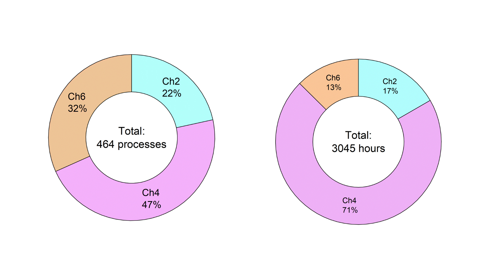
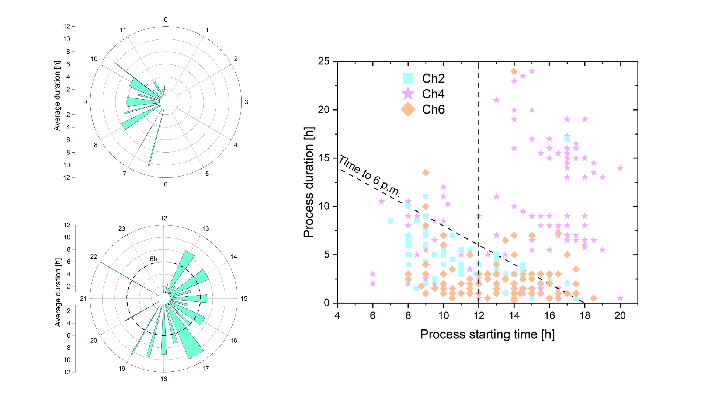
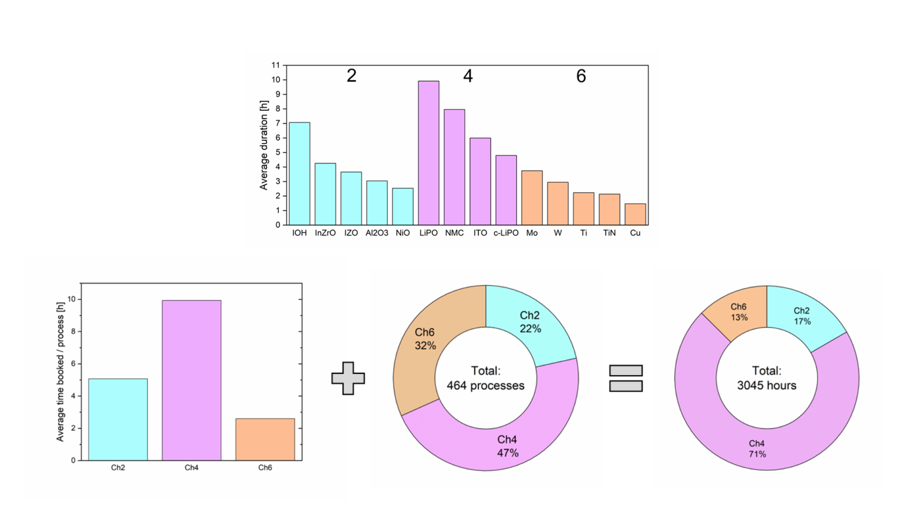
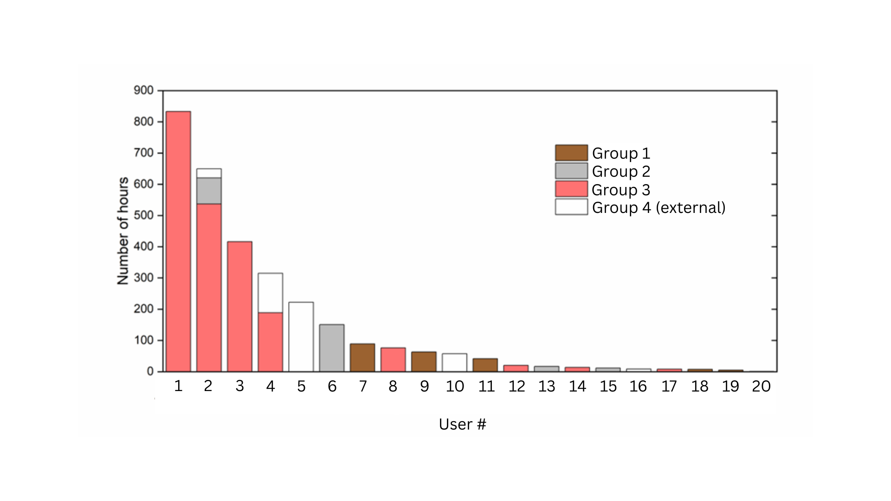
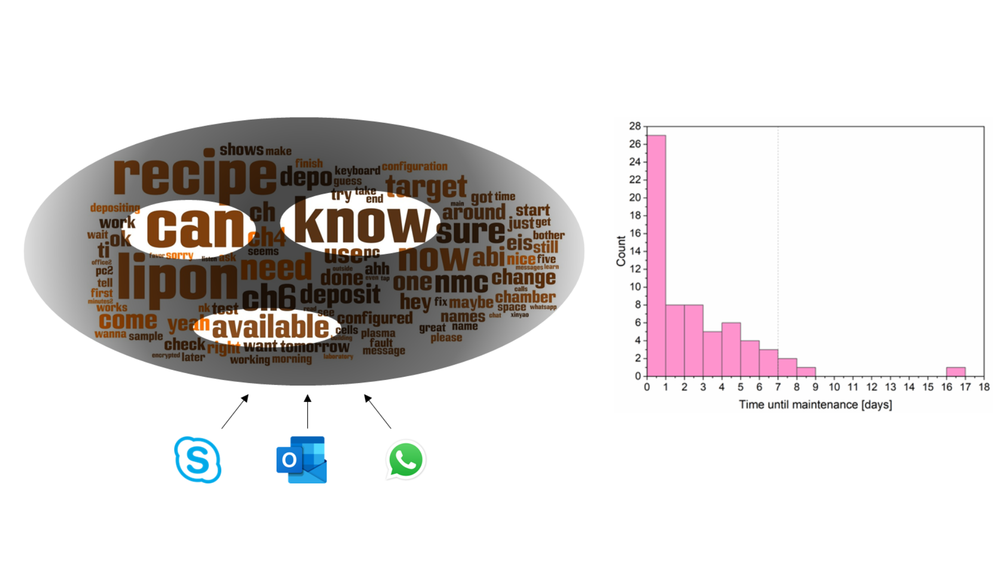
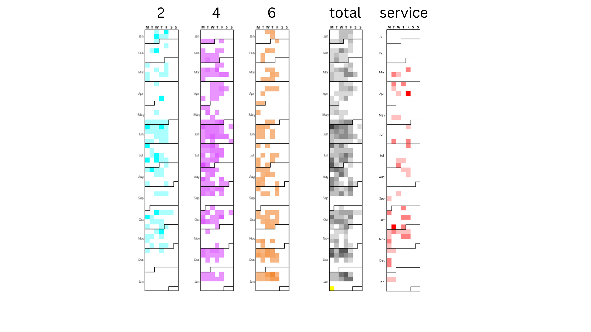

# 📘 Cluster Tool Usage Report  
### *Coating Competence Center – Usage Summary*  
**Period Analyzed:** January 1, 2024 – January 15, 2025   
---

## 🧭 Summary & context

The **Cluster Tool (CT)** at the Coating Competence Center of EMPA is a cornerstone for agile thin-film deposition and experimentation. It is a cluster of three deposition chambers (Chamber 2, 4 and 6), each with different material targets installed, which users can use for sputtering, for a plethora of
applications, including both internal and external projects in various industries.

With over **3,000 hours** of logged operations and **462 individual processes**, CT supports intensive internal and collaborative R&D, remaining highly reliable with minimal downtime.

---

## 📊 1. Usage Overview

**Key Stats:**
- **>88% Utilization** – Only ~1 free day every two weeks.
- **Total Runtime**: 3,045+ hours (~6 hours/day average).
- **462 Processes** completed since Jan 1, 2024.
- Fun Fact: *"Enough time to watch Lord of the Rings 268 times!"*

---

## 🔬 2. What’s Available in CT

- **Longest-standing Target**: **Titanium (Ti)** in **Chamber 6**, in continuous use since installation.
- **Target Material Requests**: Allowed on-demand, supporting flexible experimentation.
- **Target Change Log**: Maintained and accessible.

---

## 📅 3. When and How Is CT Used?

### 📆 Advance Booking Behavior

- **Most bookings are made 1 day in advance**, indicating fast-paced experimental workflows.
- Negative values represent bookings done retroactively, after the starting time has passed, likely for spontaneous processes.

### ☀️ Time-of-Day Preferences

- **Afternoon and overnight runs are most common**.
- Runs are **clustered near End-of-Day (EOD)**.
- **Chamber 4** often used for longer processes extending overnight.

---

## 🧪 4. Chamber Insights

### ⚖️ Comparison Across Chambers

- **Chamber 2 & 6**: Favor faster, thinner processes.
- **Chamber 4**: Longer, more complex operations.

---

## 👤 5. Who Uses CT?

- **External users represent a significant portion**.
- Highlights importance of accessibility and documentation.

---

## 💡 6. User Needs Evolution

Information compiles from all messages, requests, questions etc. across all communication channels, into a word cloud, in order to identify
the main user needs.

Users have questions about:
1. **Availability** – Access to infrastructure, availability in schedule
2. **Knowledge** – Access to information
3. **Ability** – Availability of immediate help
4. **Urgency** – Is there a compelling driver (e.g. deadlines)?
	- The vast majority of maintenances/interventions happen within a day of the issue being reported.

---

## ⚙️ 7. Downtime vs. Usage

- **No correlation between system usage and breakdowns**.
- **Agile maintenance works** — CT is durable under pressure.

---

## 🔭 8. Outlook & Opportunities

### Suggested Improvements:
- 📅 Centralized calendar and material availability dashboard.
- ⚙️ Add **DC sputtering** capability for RF-only materials.
- ➕ Support **co-sputtering** from multiple targets.
- 🐛 Add **debugging logs** for error tracking.
- 📬 Build a **feedback loop** for user experience enhancement.

---

## ✅ Conclusions

The Cluster Tool is:
- **Highly utilized and agile** for rapid R&D.
- **Reliably maintained** with no usage-linked downtime.
- Ready for next steps: **automation, co-sputtering, and user system enhancements**.

